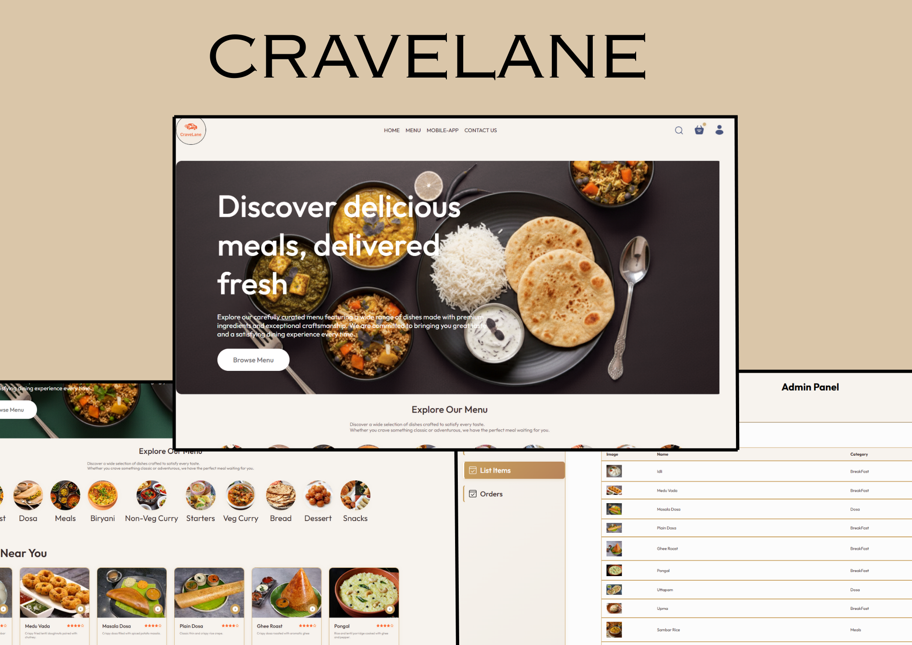

# CraveLane

CraveLane is a full-stack food delivery platform built using the MERN stack. It provides a smooth, responsive ordering experience for users and a powerful admin panel for managing menu items, orders, and live status tracking. The application integrates Stripe to enable secure and seamless payment processing.

---

## Live Site

**Frontend:** https://cravelane-frontend.onrender.com/

---

### User Features

- Secure authentication (JWT-based)  
- Dynamic menu browsing  
- Cart management (add/remove/update)  
- Stripe-powered checkout  
- Order placement and order history  
- Live order tracking  

### Admin Features

- Add, remove, and update menu items  
- Real-time order tracking dashboard  
- Update order status  
- Admin static UI served separately  

---

## Tech Stack

### Frontend
- React  
- Vanilla CSS  

### Backend
- Node.js  
- Express.js  

### Database
- MongoDB with Mongoose  

### Payments
- Stripe  

### Deployment
- Render (Frontend + Backend)

---
## Installation

### Clone the repository
```bash
git clone https://github.com/ruhan-2908/CraveLane.git
cd CraveLane
```

---

## Install Dependencies

### Backend
```bash
cd backend
npm install
```

### Frontend
```bash
cd frontend
npm install
```

---

## Environment Variables

### Backend (.env)
```ini
MONGODB_URI=your_mongodb_connection_string
JWT_SECRET=your_jwt_secret
STRIPE_SECRET_KEY=your_stripe_secret_key
```

### Frontend (.env)
```ini
REACT_APP_BACKEND_URL=http://localhost:5000
REACT_APP_STRIPE_PUBLIC_KEY=your_stripe_public_key
```

---

## Running the Application

### Start backend
```bash
cd backend
npm server
```

### Start frontend
```bash
cd frontend
npm dev
```
---

## Future Enhancements
- Delivery partner application  
- Push notifications  
- Discounts & coupons  
- Real-time tracking with WebSockets  
- Personalized recommendations  

---

## License
This project is under the MIT License.

---
